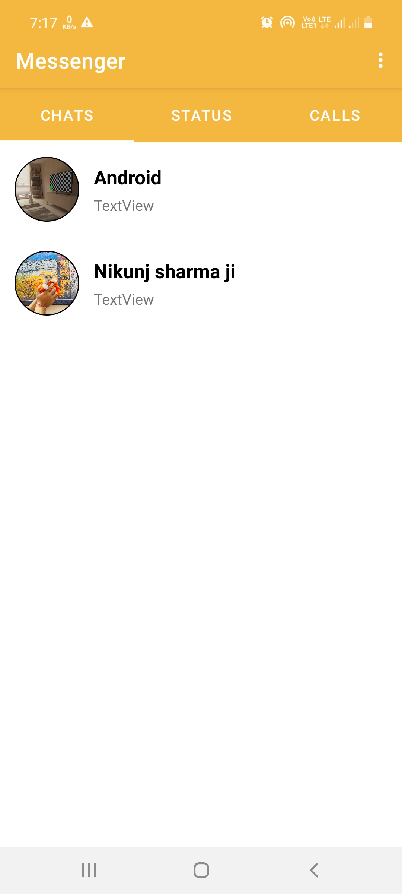
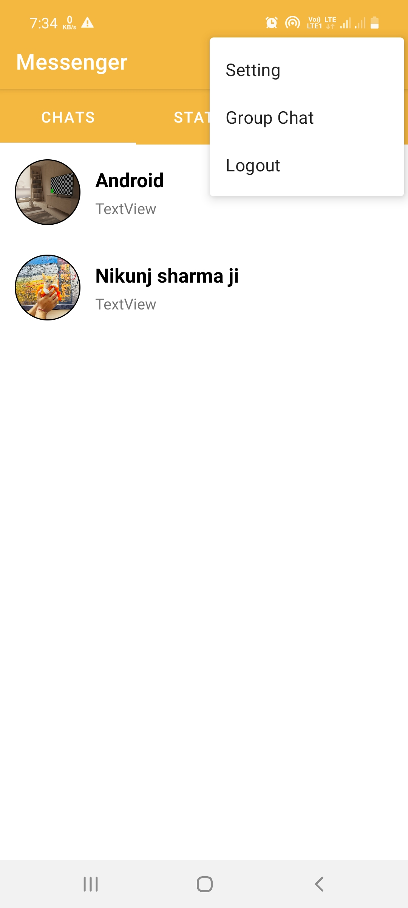
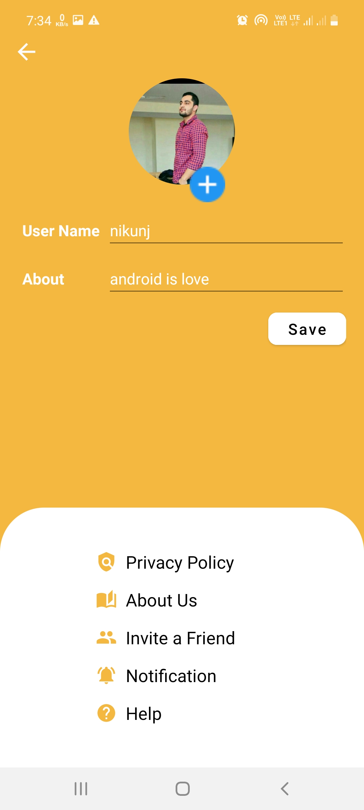
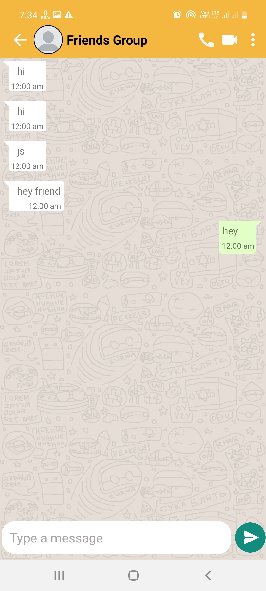
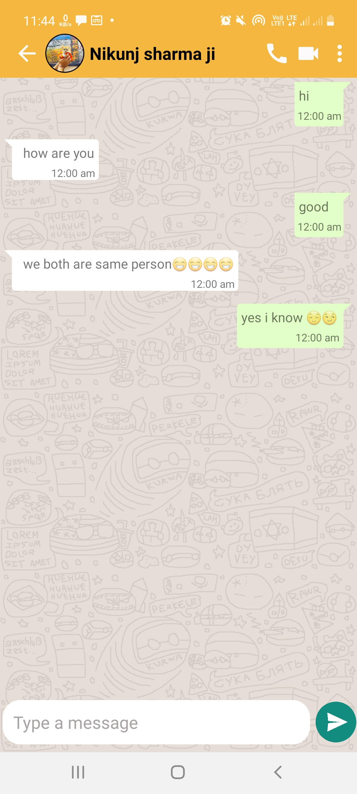
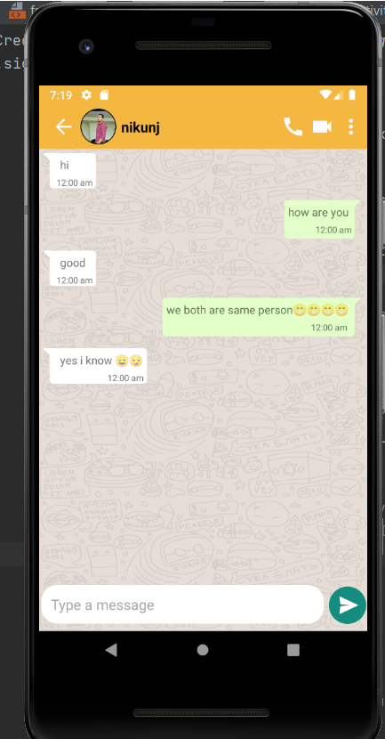

# Messenger
Messenger(Chat app) is a real time one to one chat application with Push Notifications made using Firebase

# Funtionality
I have use firebase as backend all the functionality shown in app is done on firebase like authentication, messaging, uploading profle pics
and Group chat also.
I am sharing few screen shot of my application

# ScreenShots
         
       

